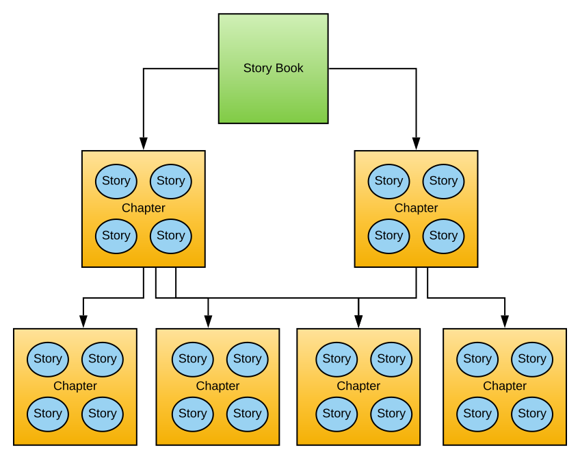

# Given

## Given

This section how to perform test arrangement with Bard. This is the part of the test that tells the 'story' of the state of the system for the test to run. 

In my opinion this is the most important part of an integration test and probably the part that is most overlooked when writing tests.

When testing a complex domain test arrangement can become convoluted. A framework like Bard encourages the developers to invest more time upfront to building a library of stories. However these stories be reused and composed into different scenarios. Overtime this will make your tests easier to write, easier to understand and easier to maintain.

In summary the goal of Bard is to make your tests:

1. Easy to read  and understand.
2. Easy to reuse.
3. More maintainable
4. Easy to compose new tests.

Bard has the concept of a `StoryBook`. The Story Book describes the way you can interact with you API/Domain in order to put it in the required state. Think of a `StoryBook`as the opening chapter of your scenario.


A `StoryBook` is the entry point into a `Scenario`.


### StoryBooks, Chapters & Stories

A `StoryBook` is made up of `Chapters` & `Stories`.

The `StoryBook` is the starting `Chapter` of our `Scenario` and from there we can select a `Story` that take us to the next `Chapter` that contains other stories.


Chapters are our decision points. What can we do given what has happened already.



Stories are the building blocks. This is where the work is done and we make changes to our domain, usually through making an API call.


What makes Bard different from other BDD style testing frameworks is that the output from one Story is the input to the next chapter and the containing stories.

Bard uses a functional approach to test arrangement and employs the [Collection Pipeline Pattern](https://martinfowler.com/articles/collection-pipeline/) 

> Collection pipelines are a programming pattern where you organize some computation as a sequence of operations which compose by taking a collection as output of one operation and feeding it into the next. - Martin Fowler

This is a powerful feature which means the output of one Story can be the input to the next Story. This can make your tests easier to write and easier to understand.

